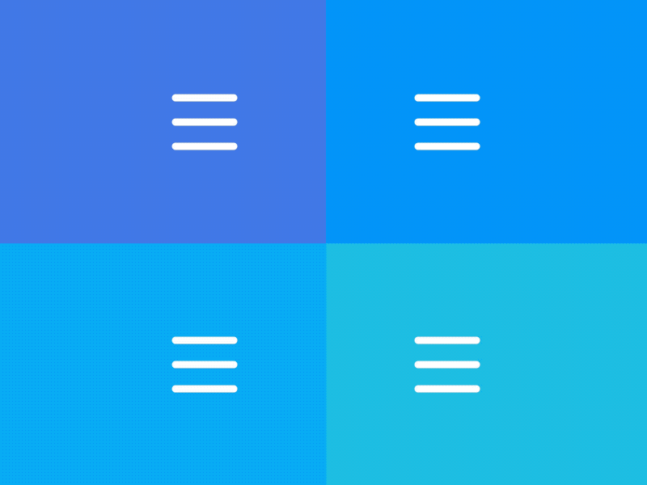
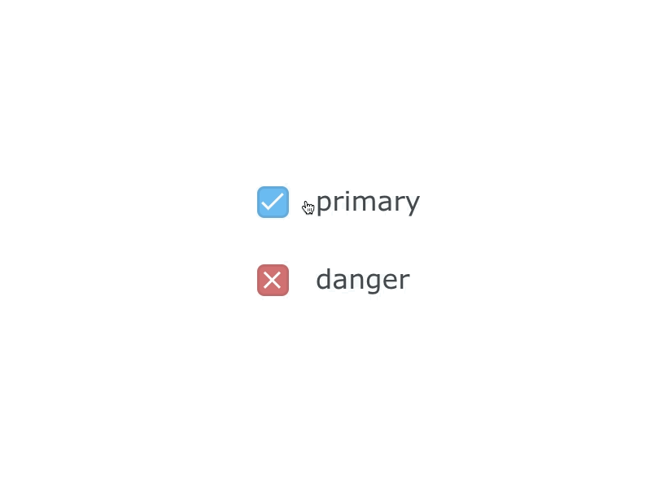
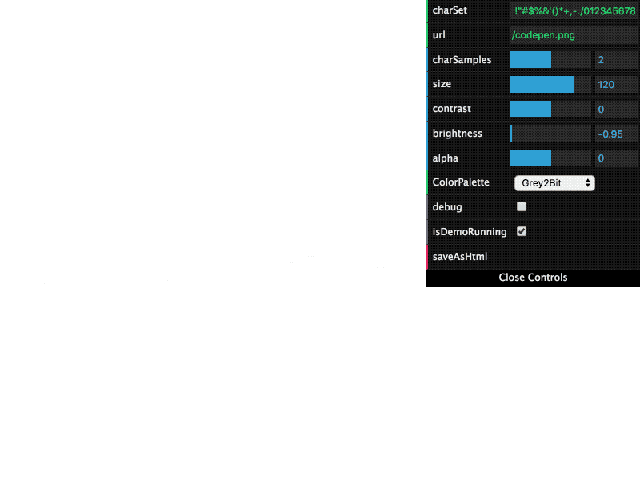
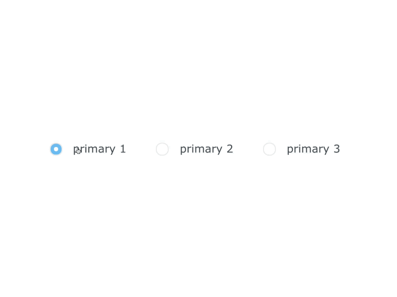
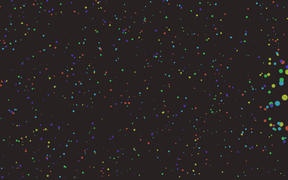

# UI Snippets

A collection of small, self-contained UI experiments — pure CSS and TypeScript,
built with [Vite](https://vitejs.dev/). Each snippet is an independent page; one
toolchain builds them all plus a gallery.

**[▶ Live gallery](https://tamino-martinius.github.io/ui-snippets/)**

> This monorepo consolidates what used to be seven separate `ui-snippets-*` repos.
> The standalone repos are archived (read-only) and redirect here.

## Snippets

| Preview | Snippet | Description | ★ |
| --- | --- | --- | --- |
|  | **[Menu Animations](https://tamino-martinius.github.io/ui-snippets/snippets/menu-animations/)** | Menu-button toggles that morph between hamburger, cross, dots and back icons. | 176 |
|  | **[Checkboxes](https://tamino-martinius.github.io/ui-snippets/snippets/checkboxes/)** | Animated, pure-CSS custom checkbox styles. | 13 |
|  | **[ASCII Art Generator](https://tamino-martinius.github.io/ui-snippets/snippets/ascii-generator/)** | Turn any image into ASCII art in the browser, with live controls. | 3 |
|  | **[Radio Buttons](https://tamino-martinius.github.io/ui-snippets/snippets/radiobuttons/)** | Animated, pure-CSS custom radio-button styles. | 3 |
|  | **[Starfield](https://tamino-martinius.github.io/ui-snippets/snippets/starfield/)** | An animated, configurable parallax starfield on a canvas. | 0 |
|  | **[Git Loading](https://tamino-martinius.github.io/ui-snippets/snippets/git-loading/)** | A loading animation styled after a git commit-graph. | 0 |

## Develop

```bash
npm install
npm run dev       # dev server with HMR (opens the gallery)
npm run build     # production build → dist/
npm run preview   # serve the production build locally
npm run deploy    # build + publish dist/ to the gh-pages branch
```

## Layout

```
ui-snippets/
├─ index.html            # gallery entry
├─ gallery/              # gallery page (main.ts, style.css, snippets.ts)
├─ snippets/
│  └─ <slug>/
│     ├─ index.html      # the snippet's standalone page
│     ├─ main.ts         # glue: load style, inject body, run logic
│     ├─ body.html       # snippet markup
│     ├─ style.css       # snippet styles (PostCSS / preset-env)
│     └─ logic.ts        # snippet behaviour
├─ vite.config.ts        # auto-discovers every snippets/*/index.html as an entry
└─ postcss.config.js
```

## Add a snippet

1. Create `snippets/<slug>/` with `index.html`, `main.ts`, `body.html`, `style.css`,
   and (optionally) `logic.ts` — copy an existing snippet as a starting point.
2. Add a `preview.gif` to the folder for the gallery thumbnail.
3. Register it in `gallery/snippets.ts`.

Vite picks up the new entry automatically — no per-snippet config.

## License

[MIT](./LICENSE) © Tamino Martinius
